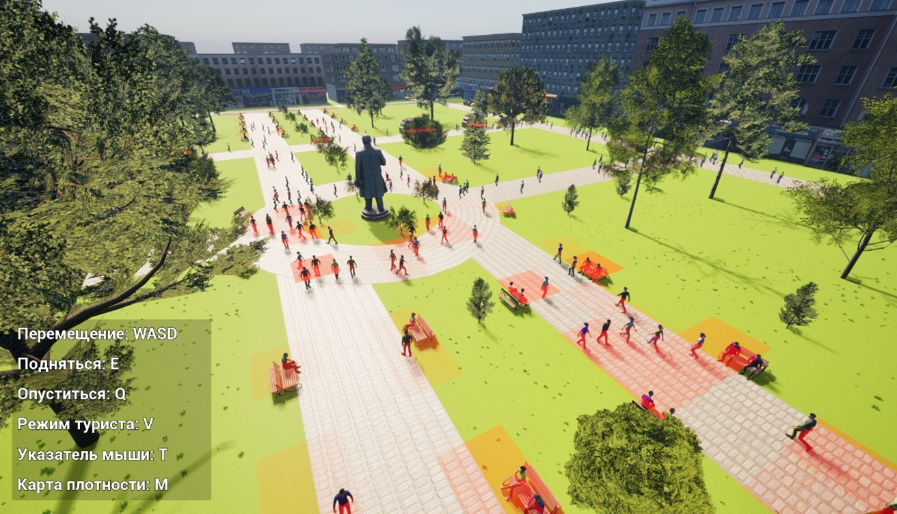

# TourSim – Симуляция туристических потоков в городской среде (Unreal Engine 5)

[](https://www.unrealengine.com)
[](https://isocpp.org/)
[](LICENSE)

**TourSim** – это инструмент для агентного моделирования и визуального анализа туристических потоков, разработанный в рамках выпускной квалификационной работы бакалавра. Проект использует **Unreal Engine 5** и **Mass Framework** (ECS-подход) для симуляции поведения сотен туристов в реальном времени с возможностью интерактивного исследования городской среды.

  
*(скриншот из режима дрона с тепловой картой плотности)*

## 🎯 Цель проекта

Создать гибкую, расширяемую систему, которая объединяет:
- трёхмерную визуализацию городской среды;
- агентное моделирование поведения туристов (предпочтения, бюджет, расстояние, стоимость POI);
- визуальный анализ потоков (тепловые карты, загрузка точек интереса).

## ✨ Ключевые возможности

| Функция | Описание                                                                                                                        |
|---------|---------------------------------------------------------------------------------------------------------------------------------|
| **Конфигурирование через JSON** | Все параметры агентов (веса предпочтений, бюджет, чувствительность к цене) задаются во внешнем файле.                           |
| **Генерация агентов из источников притока** | Разные типы источников со своими профилями (например, "автобусная остановка", "парковка").                                      |
| **Поведенческая модель** | Выбор целевой точки интереса (POI) на основе функции полезности, учитывающей потребности, предпочтения, расстояние и стоимость. |
| **Массовая симуляция** | Использование **Mass Entity** (ECS) для обработки тысяч агентов с высокой производительностью.                                  |
| **Визуализация потоков** | Агенты отображаются в 3D-сцене; тепловая карта плотности накладывается на ландшафт.                                             |
| **Управление** | Два режима: персонаж (вид от первого/третьего лица) и дрон (свободная камера).                                                  |
| **Интерактивный UI** | Информационные виджеты по выделенным агентам/POI, настройка параметров до запуска.                                              |

## 🧠 Архитектура

Проект построен на совместном использовании **C++** (основная логика, процессоры Mass, подсистемы) и **Blueprints** (визуальное представление, управление камерой, виджеты). Внутреннее ECS-представление агентов (Mass Entity) отделено от акторов сцены, что позволяет эффективно обновлять состояние и синхронизировать отображение.

**Основные компоненты:**
- Agents – логика туристов через Mass Framework: фрагменты данных (предпочтения, бюджет), процессоры (инициализация, выбор цели, движение), трейты.
- POI – точки интереса: типы, стоимость, вместимость; подсистема для регистрации и поиска ближайших объектов.
- Spawn – генерация агентов из источников (остановка, парковка): данные по профилям, процессор создания сущностей, подсистема координации.
- Pawn – управление персонажем (WASD) и дроном.
- Visualization – тепловая карта плотности (HeatmapGridActor).

## 🛠 Технологии

- **Движок**: Unreal Engine 5.5
- **Языки**: C++17, Blueprints
- **Фреймворк симуляции**: Mass Entity (ECS)
- **Формат данных**: JSON
- **IDE**: JetBrains Rider
- **3D-модели**: Blender, Sketchfab, Mixamo
- **Система контроля версий**: Git

## 📋 Системные требования

- Процессор: Intel Core i5-12400 или аналог
- ОЗУ: 16 ГБ
- Видеокарта: NVIDIA RTX 3060 / аналогичная
- SSD: 20 ГБ

## 🚀 Установка и запуск

1. **Установите Unreal Engine 5.5** из Epic Games Launcher (или соберите из исходников).
2. **Клонируйте репозиторий**:
   ```bash
   git clone https://github.com/MrFireDeN/TourSim.git
   ```
3. **Откройте проект**:
    - Запустите `TourSim.uproject` (при необходимости согласитесь на перекомпиляцию модулей).
4. **Соберите проект** (если требуется):
    - В редакторе Unreal: `Compile` -> `Build TourSim`.
    - Или используйте генератор проектных файлов и соберите в Rider/VS.
5. **Запустите симуляцию**:
    - В редакторе нажмите `Play`.
    - Или запакуйте проект в исполняемый файл (File → Package Project → Windows).

## 🎮 Использование

### Главное меню
- **Начать** – переход к настройке параметров и симуляции.
- **О программе** – справочная информация.
- **Выход** – выход.

### Экран настройки
- Загрузите JSON-конфигурацию (кнопка `загрузить JSON`).
- Отредактируйте параметры агентов для разных типов источников.
- Нажмите `Запусить` – запустится симуляция.
- Выберете одну из двух карт

### Во время симуляции
- **Выбор объекта**: наведите курсор на агента и кликните ЛКМ – появится информационный виджет.
- **Тепловая карта**: нажмите `M` (переключатель) для отображения/скрытия плотности агентов.
- **Режимы управления**: нажмите `V`
    -  режим персонажа (передвижение WASD, мышь – осмотр).
    -  режим дрона (свободный полёт, Q/E – вверх/вниз).
- **Курсор**: `T` – показать/скрыть курсор мыши.

## 📂 Пример конфигурационного файла (JSON)

```json
{
  "parkingProfile":
  {
    "wBenchMin": 0.4,
    "wBenchMax": 0.8,
    "wMonumentMin": 0.2,
    "wMonumentMax": 0.5,
    "wFastFoodMin": 0.6,
    "wFastFoodMax": 0.9,
    "priceSensitivityMin": 0.25,
    "priceSensitivityMax": 0.75,
    "bRandomizeWeights": true,
    "weightVariation": 0.2,
    "bNormalizeWeights": true,
    "minMoneyCents": 10,
    "maxMoneyCents": 1000,
    "initialNeedMin": 0,
    "initialNeedMax": 0.25,
    "initialDecisionCooldownMin": 0.1,
    "initialDecisionCooldownMax": 1
  }
}
```

## 📊 Производительность

| Кол-во агентов | Средний FPS (RTX 3060, 1920×1080) |
|----------------|-----------------------------------|
| 1000           | 75                                |
| 2000           | 62                                |
| 5000           | 36                                |
| 6000           | 31 (минимально приемлемо)         |

> Система сохраняет стабильную работу до 6000 агентов с плавным снижением FPS, без резких скачков.

## 🧪 Тестовые сценарии

Проект включает две тестовые сцены с разным расположением POI:
- **Компактная застройка** – высокая концентрация агентов, перегрузка отдельных зон.
- **Распределённая застройка** – равномерное распределение потоков, снижение нагрузки.

Эти сценарии демонстрируют чувствительность модели к пространственной конфигурации городской среды.

## 👥 Авторы

- **Свиридов Денис Евгеньевич** – разработка, исследование (студент группы ИСТ-1-22, ВолгГТУ)
- **Научный руководитель:** к.т.н., доцент Рашевский Николай Михайлович

## 📄 Лицензия

Проект распространяется под лицензией MIT. См. файл [LICENSE](LICENSE).
